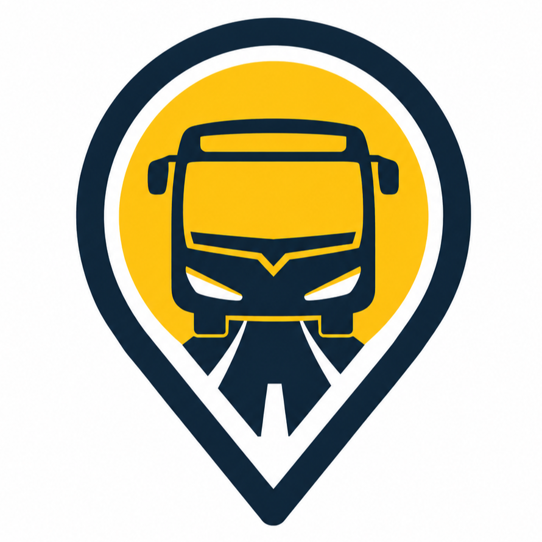

<p align="center">
  
</p>

<h1 align="center">🚐 Shuttle D-Voyager</h1>

<p align="center">
  <strong>Sistem Manajemen & Pemesanan Tiket Shuttle Terpadu</strong><br>
  Aplikasi terintegrasi untuk Admin, Driver, dan Pelanggan dengan dukungan pelacakan lokasi (GPS Tracking) secara real-time.
</p>

<p align="center">
  
  
  
  
</p>

---

## ✨ Fitur Utama

D-Voyager dirancang dengan 3 environment utama yang saling terhubung:

### 👑 1. Admin Panel (Web Dashboard)
- **Manajemen Lengkap**: Kelola Data Rute, Armada (Kendaraan), Supir (Driver), dan Pelanggan.
- **Manajemen Jadwal & Harga Dinamis**: Pengaturan jadwal perjalanan dengan harga dinamis ala *Traveloka*.
- **Live Tracking**: Peta pelacakan armada yang sedang *On The Way* (Berjalan) secara real-time.
- **Reporting & Analytics**: Ringkasan laporan pendapatan, jumlah tiket, dan ekspor laporan ke format **PDF & Excel**.

### 📱 2. Customer App (Mobile / Web)
- **Pencarian Cerdas**: Cari dan saring rute keberangkatan & tujuan secara instan.
- **Pemesanan Kursi (Seat Selection)**: Pilih nomor kursi sesuai ketersediaan pada jadwal yang dipilih.
- **Riwayat & E-Ticket**: Pantau riwayat perjalanan dan akses tiket elektronik.
- **Live Chat**: Fitur perpesanan langsung (Chat) dengan Driver maupun Customer Service.

### 🚗 3. Driver App (Mobile)
- **Tugas Harian**: Cek daftar jadwal perjalanan yang ditugaskan kepada *driver*.
- **Manifest Penumpang**: Lihat daftar lengkap penumpang beserta status pemesanannya.
- **Update Lokasi & Status**: Driver dapat memulai (*start*) dan menyelesaikan (*finish*) perjalanan, dimana sistem otomatis melacak koordinat GPS ke server.
- **Riwayat**: Catatan perjalanan yang telah berhasil diselesaikan (*completed*).

---

## 🛠️ Teknologi yang Digunakan

* **Backend & Admin Panel:** [Laravel](https://laravel.com/) (PHP) + Blade Templates
* **Mobile / Frontend:** [Ionic Framework](https://ionicframework.com/) + [Angular](https://angular.io/)
* **Database:** MySQL
* **Export Library:** `maatwebsite/excel` & `barryvdh/laravel-dompdf`

---

## 🚀 Instalasi & Persiapan Menjalankan Proyek

Pastikan Anda sudah menginstal **PHP, Composer, Node.js, dan MySQL** di sistem Anda.

### 1. Menjalankan Backend (Laravel)

```bash
# Masuk ke direktori backend
cd shuttle-system

# Install ekstensi PHP & library Composer
composer install

# Salin file .env dan sesuaikan konfigurasi database
cp .env.example .env

# Generate application key
php artisan key:generate

# Migrasi Database (dan seeders jika ada)
php artisan migrate

# Jalankan server lokal
php artisan serve
```
*Akses Admin Dashboard di: `http://localhost:8000/admin/login`*

### 2. Menjalankan Frontend (Ionic/Angular)

```bash
# Buka terminal baru dan masuk ke direktori frontend
cd D-Voyager-FrontEnd

# Install package Node.js
npm install

# Jalankan server Ionic
ionic serve
```
*Aplikasi frontend dapat diakses di: `http://localhost:8100`*

---

## 📸 Tampilan Aplikasi

*(Tambahkan screenshot antarmuka aplikasi di sini untuk mempercantik README)*

---

## 👨‍💻 Kontribusi
Dibuat dan dikembangkan untuk operasional Shuttle System masa depan. Semua *pull-request* sangat dihargai untuk perbaikan *bug* dan peningkatan *logic*.
